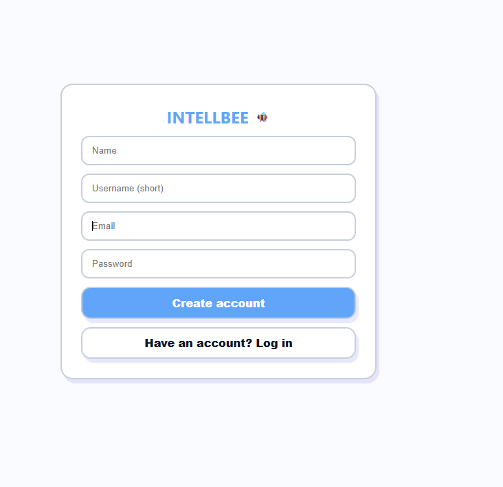
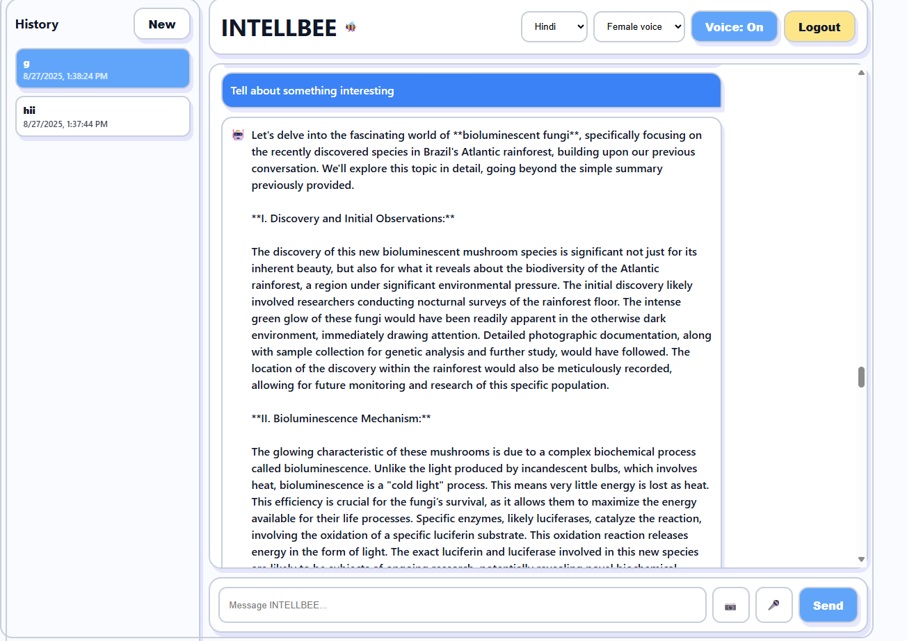

# 🐝 INTELLBEE – Your Multilingual AI Assistant

> A smart, voice-enabled AI chatbot powered by **Google Gemini**, supporting **Tamil, English**, and more. Built with React, Flask, and modern web tech.



*Login screen with clean, modern UI*



*Interactive chat with Tamil support and voice input*

## 🚀 About

**INTELLBEE** is a full-stack AI chat application that allows users to:
- 💬 Chat in **Tamil, English**, or any language
- 🎙️ Use **voice input** to speak to the AI
- 🔊 Hear **female voice responses**
- 📚 Save **conversation history**
- 🌙 Toggle **dark/light mode**
- 🧠 Powered by **Google Gemini 1.5 Flash**

Perfect for students, professionals, or anyone who wants an AI assistant in their native language.

---

## 🛠️ Tech Stack

| Layer | Technology |
|------|------------|
| Frontend | React + Vite |
| Backend | Flask (Python) |
| AI Model | Google Gemini 1.5 Flash |
| Voice | Web Speech API (Speech-to-Text & Text-to-Speech) |
| Data | JSON (conversation history) |
| Styling | Tailwind CSS |
| Build Tool | Vite (replaces deprecated Create React App) |

---

## 📦 How to Run Locally

Follow these steps to run **INTELLBEE** on your computer:

### 1. Clone the repository
```bash
git clone https://github.com/your-username/intellbee.git
cd intellbee
---

## 🧠 Tech Stack  

### Frontend  
- React + Vite  

### Backend  
- Flask + Python  

### AI Model  
- Google Gemini 1.5 Flash  

### Voice  
- Web Speech API  

### Data Storage  
- JSON files (`data/conversations.json`)  

---

## 🚀 Getting Started  

### 1. Clone the Repository  
```bash
git clone https://github.com/Dharshika-112/IntellBee-AI.git
cd IntellBee-AI
````

### 2. Get Gemini API Key

* Go to: [Google AI Studio](https://aistudio.google.com/app/apikey)
* Click **"Create API Key"**
* Copy the generated key

### 3. Configure API Key

* Open the project folder
* Create a new file named `.env` (or update `config.js` / `backend.py` accordingly)
* Add your API key:

```env
GEMINI_API_KEY=your_api_key_here
```

### 4. Run the Project

#### Frontend (React + Vite)

```bash
cd frontend
npm install
npm run dev
```

#### Backend (Flask + Python)

```bash
cd backend
pip install -r requirements.txt
python app.py
```

### 5. Access the App

* Open `http://localhost:5173` (Frontend)
* Backend will run on `http://localhost:5000`

---

## 📌 Demo

🎥 Watch the demo video: [IntellBee AI Demo]()

---

## 📂 Repository

🔗 [GitHub: INTELLBEE-AI](https://github.com/Dharshika-112/IntellBee-AI)

---

## 🤝 Contribution

Contributions, issues, and feature requests are welcome!
Feel free to fork this repo and submit pull requests.

---

## 📧 Contact

👩‍💻 Developed by **Dharshika D S**

* [LinkedIn](https://www.linkedin.com/in/dharshi1106/)
* [GitHub](https://github.com/Dharshika-112)
* 📩 [dsdharshika5@gmail.com](mailto:dsdharshika5@gmail.com)

```

```
